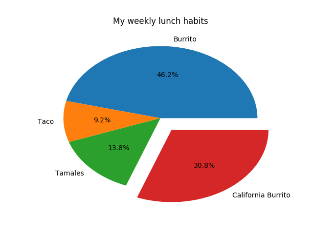
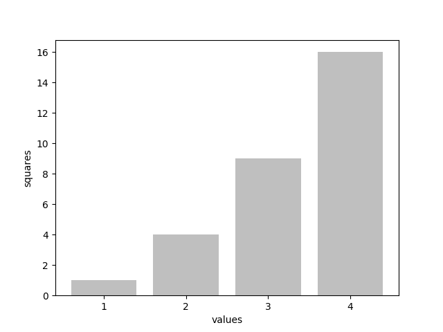
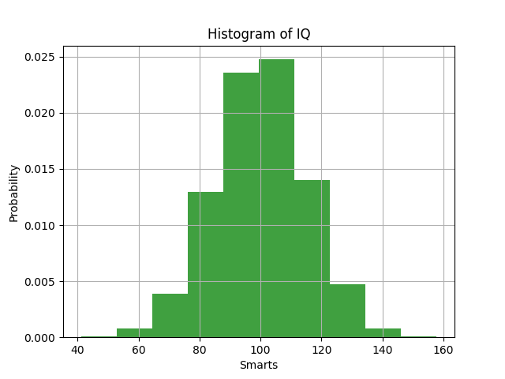

# python_tutorial
This is brief introduction and hands-on tutorial to Python programming language. Examples are highlighted in Spyder IDE screenshots in each slide.

Some data visualization examples:

# Pie Chart

# Bar Chart

# Histogram

